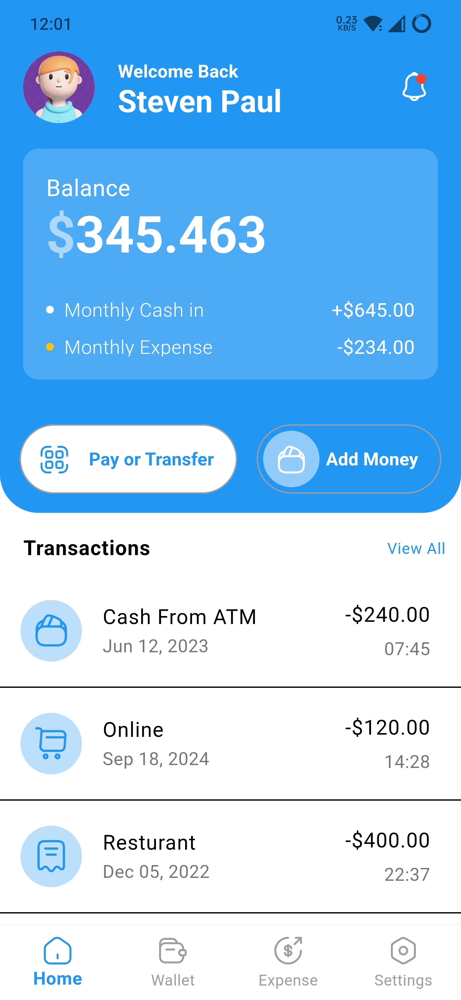
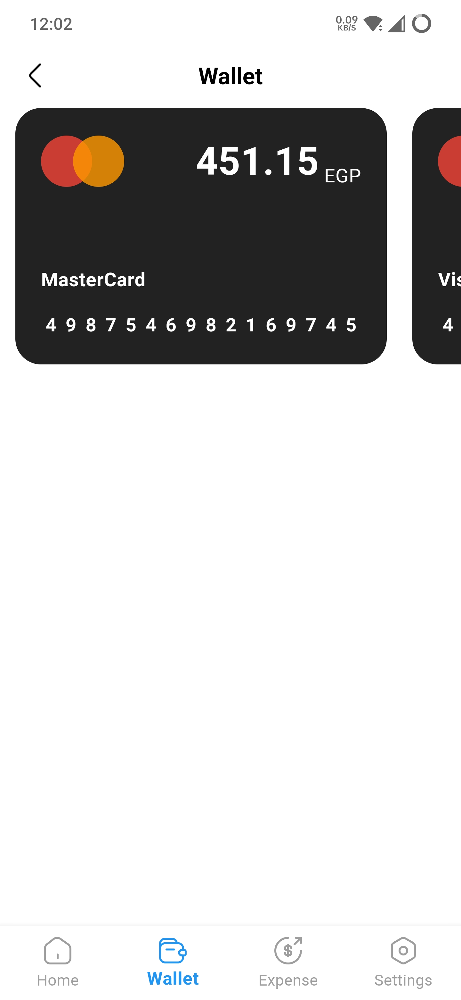
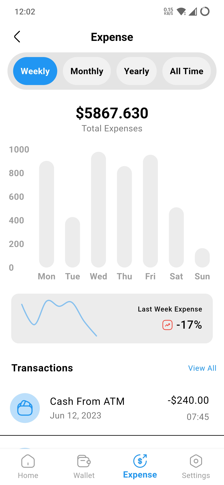
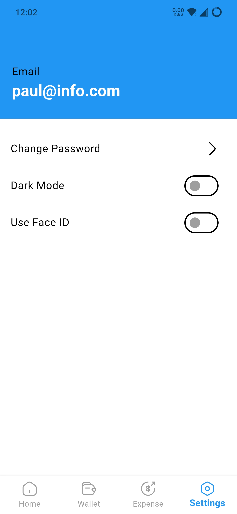

# Flutter Finance Management App

## Overview

Welcome to the Flutter Finance Management App! This app helps you manage your finances efficiently
by providing an easy-to-use interface for tracking your balance, viewing transactions, monitoring
expenses, and managing your settings.

## Features

- **Home Page**: Displays the total balance and the last transactions.
- **Wallet Screen**: Shows connected bank cards.
- **Expenses Screen**: Displays expenses using a bar chart and shows last week's expense changes.
- **Settings Screen**: Allows users to change the app theme and update their password.

## Screenshots
| Home Screen | Wallet Screen |
| --- | --- |
|  |  |

| Expenses Screen | Settings Screen |
| --- | --- |
|  |  |

## Installation

To run this project, ensure you have Flutter installed on your machine. If not, you can download it
from the [official Flutter website](https://flutter.dev).

1. Clone this repository:

```bash 
git clone https://github.com/HossamAElsayed/finance_management_app.git
```

2. Navigate to the project directory:

```bash 
cd flutter-finance-management-App
```

3. Navigate to the project directory:

```bash 
flutter pub get
```

4. Run the app

```bash
flutter run
```

## Usage

Home Page
The home page displays your total balance at the top and lists your most recent transactions below.

Wallet Screen
The wallet screen shows all your connected bank cards with details.

Expenses Screen
The expenses screen presents your spending in a bar chart format, highlighting changes in expenses
over the past week.

Settings Screen
In the settings screen, you can switch between light and dark themes and change your password.

## Contributing

Contributions are welcome! Please fork this repository and submit a pull request for any features,
bug fixes, or enhancements.

## License

This project is licensed under the MIT License. See the LICENSE file for more details.

## Contact

# If you have any questions or feedback, feel free to reach out at [hossamahmed79766@gmail.com].

## Development Notes

### Dependencies

This app uses the following Flutter packages:

```Equatable``` for some objects methods

```provider``` for state management

```fl_chart``` for displaying bar charts and line chart

